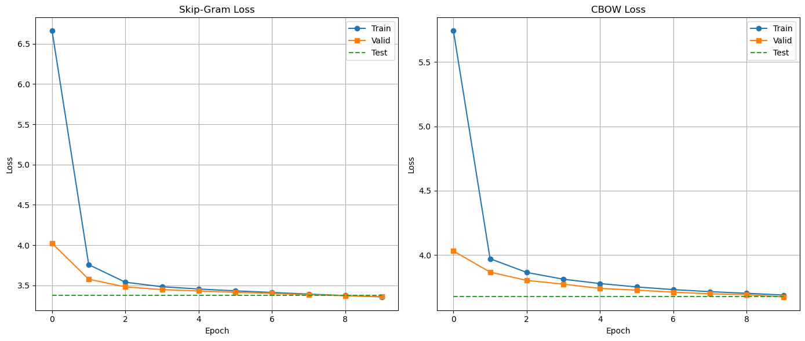
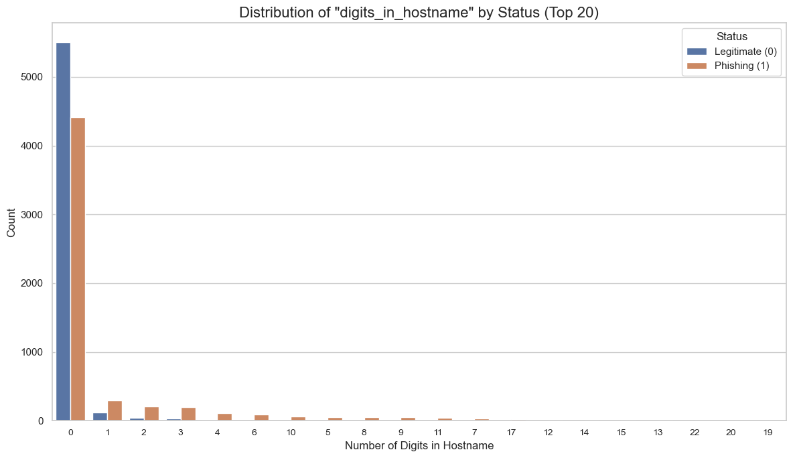
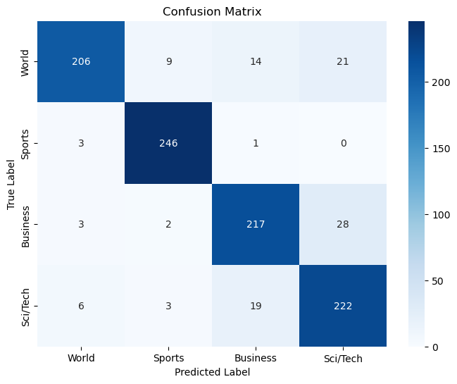
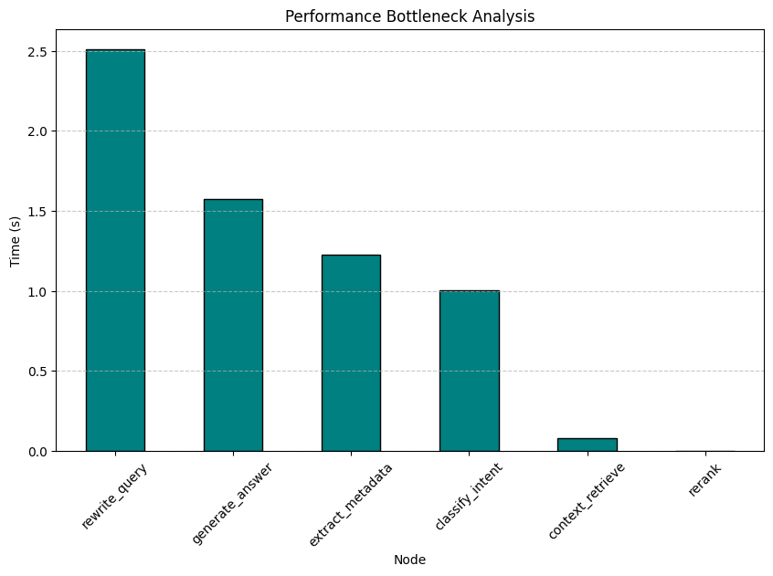
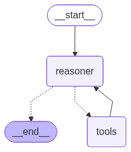

# NLP: From Tokenizers to Tool-Calling Agents

Seven self-contained projects tracing a path through natural language
processing — from regular-expression tokenizers and n-gram counts, through
embeddings and fine-tuning, to retrieval-augmented generation and tool-calling
agents. The early notebooks implement everything from scratch in NumPy; the
later ones build on transformers, LanceDB, and LangGraph.

Two things run through all of them: **the mechanism is written out rather than
imported**, and **the result is interpreted rather than reported**. Several of
the more interesting findings below are negative ones.

## Results

| # | Notebook | What it builds | Headline result |
|---|---|---|---|
| 01 | [Tokenization and N-gram Models](notebooks/01_tokenization_and_ngram_models.ipynb) | Regex tokenizers, edit distance, BPE/WordPiece on Persian, n-gram LMs | Unsmoothed 4-gram perplexity **∞** → Laplace **3,494** → backoff **35.9**, from identical counts |
| 02 | [Text Classification from Scratch](notebooks/02_text_classification_from_scratch.ipynb) | Logistic regression + 3 Naive Bayes variants, NumPy only | 3 → 9 engineered features lifts URL accuracy **59.1% → 72.9%**, F1 **0.35 → 0.71** |
| 03 | [Embeddings and Neural Classification](notebooks/03_embeddings_and_neural_classification.ipynb) | Word2Vec (CBOW + Skip-Gram) with hand-derived gradients, FastText, MLP | Near-identical loss (3.36 vs 3.67), **qualitatively different embedding spaces** |
| 04 | [Text-to-SQL: Seq2Seq vs Causal](notebooks/04_text_to_sql_seq2seq_vs_causal.ipynb) | BART-base vs GPT-2, same data, same metric | BART **22.3%** vs GPT-2 **20.5%** — and the metric, not the models, is the weak link |
| 05 | [LoRA Instruction Tuning](notebooks/05_lora_instruction_tuning.ipynb) | LoRA on TinyLlama-1.1B, measured with IFEval | **3.5–4.3× on all four IFEval metrics** from training 2.24% of parameters |
| 06 | [Persian Legal RAG](notebooks/06_persian_legal_rag.ipynb) | 6-node LangGraph pipeline over LanceDB, RAGAS-evaluated | Faithfulness **0.734** vs relevancy **0.514** — grounded in the *wrong* text, and why |
| 07 | [Tool-Calling Travel Agent](notebooks/07_tool_calling_travel_agent.ipynb) | LangGraph agent, 7 tools, live APIs | 14 bilingual scenarios; parallel tool calls work, **`plan_trip` has no geographic reasoning** |

### Loss curves hid the difference between CBOW and Skip-Gram



Skip-Gram converges to 3.36 and CBOW to 3.67 — close enough that the curves
suggest two variants of the same result. They aren't. Probing nearest
neighbours shows Skip-Gram learned semantics while CBOW collapsed onto function
words for *every* probe:

| Probe | Skip-Gram | CBOW |
|---|---|---|
| `album` | studio, reception, band, guitar, song | before, over, two, an, when |
| `king` | author, queen, jane, editor, lady | two, including, between, several, some |

The cause is context averaging: CBOW averages the window before predicting, and
function words appear in nearly every window, so they dominate the average.
Skip-Gram predicts each context word separately, so nothing washes the signal
out. A loss curve would never have shown this.

### One feature carries the phishing classifier



`digits_in_hostname` gets a learned weight of **+2.09**, more than twice the
next feature. The nine-feature model reaches 72.9% accuracy where each
three-feature group alone manages 54–68% — the groups are complementary because
each covers a different subset of phishing URLs.

Gaussian Naive Bayes is the instructive failure: **best precision of any model
(0.9275) and the worst F1 (0.4166)**, because `length_url`,
`longest_words_raw`, and `ratio_digits_url` are all functions of the same
string, so its independence assumption is badly violated. It ends up confident
and nearly silent, firing on 27% of positives.

### The confusion matrix says more than the accuracy



89.10% accuracy, 0.8909 macro-F1. But **47 of 76 errors are Business ↔
Sci/Tech** — one pair accounts for 62% of all mistakes, while Sports is nearly
perfect at 246/250. That is a property of the label set, not a modelling
failure: a story about a chip company's earnings is legitimately both.

### Where the RAG pipeline actually spends its time



Retrieval is **1.3% of wall-clock time**; four sequential LLM calls are 98%.
Two findings fell out of instrumenting it:

- The `rerank` node runs in **9 µs** — it is named for something it does not do.
- The metadata filter is extracted correctly but arrives at retrieval as `{}`
  on all 21 queries, so every query silently falls back to unfiltered vector
  search. That is the concrete explanation for faithfulness 0.734 against
  relevancy 0.514: the answers are grounded, just in the wrong articles.

### A tool-calling agent, evaluated honestly



The agent resolves relative dates, maps free-text city names to IATA codes, and
calls four tools in parallel when one request needs them. It also fails: a
Persian FAQ query retrieved a chunk about language barriers instead of travel
documents, and the LLM covered for it by answering correctly from its own
knowledge — a retrieval failure that end-to-end scoring would have marked as a
pass. Scenario-by-scenario writeup in
**[docs/travelbot-evaluation.md](docs/travelbot-evaluation.md)**.

## Setup

```bash
pip install -r requirements.txt
jupyter lab
```

Notebooks resolve data through a `DATA` path set in their first cell, so they
run from either the repository root or `notebooks/`. Small datasets are
committed; larger ones download on first run. See
[data/README.md](data/README.md) for the full inventory and for the one corpus
that is not redistributed here.

Notebooks 01–04 run on CPU. 05 needs a CUDA GPU for LoRA training; 06 needs one
for the optional vLLM/DeepSeek-OCR ingestion path.

### Credentials

Notebooks 06 and 07 call external services. **There is no `.env` file in this
repository by design** — the notebooks read the process environment directly,
and their first cell fails immediately with the names of anything missing
rather than erroring deep inside a chain. Export what you need before starting
Jupyter:

| Variable | Needed by | What it is |
|---|---|---|
| `LLM_API_KEY` | 06, 07 | Key for an OpenAI-compatible chat endpoint |
| `OPENAI_API_KEY` | 06 | Used by RAGAS for evaluation |
| `OPENAI_API_BASE` | 06 | Base URL of that endpoint |
| `AMADEUS_CLIENT_ID` | 07 | Amadeus flight and hotel search |
| `AMADEUS_CLIENT_SECRET` | 07 | |
| `TAVILY_API_KEY` | 07 | Web search, behind the restaurant tool |
| `HF_TOKEN` | 05 | Only to push the trained adapter to the Hub |
| `LLAMA_CLOUD_API_KEY` | 07 | Optional — only to re-parse the travel guide PDF. The parsed output is committed. |

```bash
export LLM_API_KEY=...
export AMADEUS_CLIENT_ID=...
```

## Notes on reproducibility

The from-scratch logistic regression in notebook 02 does **not** reproduce
bit-exactly. The recorded run gives 0.9488 accuracy; re-running gives 0.9478
multi-threaded and 0.9469 single-threaded. The cause is BLAS reduction-order
nondeterminism in the hand-written gradient descent, which moves one or two of
1,035 test samples across the 0.5 decision boundary. Everything else checked
reproduces exactly, including the Multinomial Naive Bayes results and all
sixteen numbers in the nine-feature URL comparison.

## License

[MIT](LICENSE)
